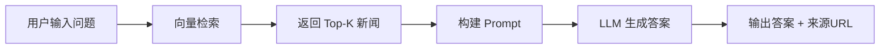

# ChronoQA-RAG：时间感知的新闻问答系统

基于 RAG（Retrieval-Augmented Generation）架构的时间敏感型新闻问答系统。使用 ChronoQA 数据集，结合本地 Qwen3-4B 模型和智谱 API，实现基于新闻的时间敏感问答。

## 🎯 项目目标

构建一个能够**理解时间信息**的智能问答系统：

- 用户提问：“COTODAMA歌词音箱和苹果停产iPhone 6系列哪个事件更早发生？”
- 系统检索相关新闻 → 理解时间关系 → 生成答案：“COTODAMA歌词音箱更早”
- 同时输出答案来源（新闻URL），保证可追溯


## 📊 项目结果

## 测试结果（5176个问答对样本）

| 模型 | 答案正确率 | URL检索正确率 |
|------|-----------|--------------|
| Qwen3-4B（本地） | （2561）49.48% | （3396）65.74% |
| 智谱 GLM-4-Flash（API） |（3026） 58.48% | （3396）65.74% |

## 📁 项目结构
```text
RAG/
├── chroma_db/                                    # 向量数据库（旧版，只有content作为page_content，其他的键作为metadata）
├── chroma_db_with_title_with_publish_date/       # 向量数据库（增强版，content+title+publish_date作为page_content）
├── models/                                       # 本地 Qwen 模型
│   └── Qwen/
│       └── Qwen3-4B-Instruct-2507/              # Qwen3-4B 模型文件
├── news_corpus_simple/                          # 原始新闻数据（6060篇新闻）
│   └── cleaned/                                  # 清洗后的新闻 JSON 文件，共5034篇新闻作为原始数据库（过滤掉1026篇无效URL、404页面的新闻）
├── qwen_test_results/                           # Qwen 模型测试结果
├── zhipu_test_results/                          # 智谱 API 测试结果
├── build_vector_db.py                           # 构建向量数据库
├── build_vector_db_new.py                       # 构建向量数据库（增强版）
├── check_data.py                                # 查看数据集信息
├── clean_and_filter.py                          # 清洗新闻数据
├── download_qwen_model.py                       # 下载 Qwen 模型
├── get_original_data.py                         # 爬取原始新闻
├── rag_qa_chat.py                               # RAG交互式问答（本地 Qwen）
├── rag_zhipu_chat.py                            # RAG交互式问答（智谱 API）
├── test_rag.py                                  # 本地 Qwen 测试（基于5034篇新闻，测试5176个问答对，统计答案准确率和 URL 检索召回率）
└── test_zhipu.py                                # 智谱 API 测试（基于5034篇新闻，测试5176个问答对，统计答案准确率和 URL 检索召回率）
```

## 🚀 快速开始

## 一. 环境配置

```bash
# 创建 conda 环境
conda create -n ChronoQA-RAG python=3.10
conda activate ChronoQA-RAG

# 安装依赖
pip install -r requirements.txt
torch>=2.0.0
transformers>=4.37.0
sentence-transformers>=2.2.0
chromadb>=0.4.0
pandas>=2.0.0
zhipuai>=2.0.0
bitsandbytes>=0.41.0
trafilatura>=1.6.0
jieba>=0.42.0
rank-bm25>=0.2.0
```
## 二. 配置国内镜像（解决国内网络连接不到 HuggingFace 导致下载模型失败的问题）
```bash
#在代码开头加上
import os
os.environ['HF_ENDPOINT'] = 'https://hf-mirror.com'
```

##  三. 准备数据
```bash
# 爬取新闻数据
python get_original_data.py

# 检查数据集信息
python check_data.py

# 清洗新闻数据
python clean_and_filter.py
```

## `clean_and_filter.py` - 新闻数据清洗脚本

### 功能说明

对爬取的原始新闻 TXT 文件进行清洗和过滤，输出结构化的 JSON 文件。

### 处理流程

1. **解析 TXT 文件**：提取标题、URL、发布时间、问答时间、正文内容
2. **过滤无效页面**：删除 404、页面不存在等无效内容
3. **过滤无效 URL**：只保留以 `http://` 或 `https://` 开头的有效链接
4. **过滤内容过短**：删除正文少于 50 字符的新闻
5. **清洗广告**：移除文末的版权声明、推广信息等无关内容
6. **输出 JSON**：保存为结构化 JSON 文件

### 过滤规则

| 过滤类型 | 关键词/条件 |
|---------|------------|
| 无效页面 | `页面没有找到`、`404`、`页面不存在` |
| 无效 URL | 不以 `http://` 或 `https://` 开头 |
| 内容过短 | 正文长度 < 50 字符 |
| 广告内容 | `VIP课程推荐`、`举报邮箱`、`Copyright` 等 |

### 使用方法


python clean_and_filter.py


### 输入输出

| 项目 | 路径 |
|------|------|
| 输入目录 | `news_corpus_simple/articles/`（TXT 文件） |
| 输出目录 | `news_corpus_simple/cleaned/`（JSON 文件） |
| 无效目录 | `news_corpus_simple/invalid/`（被过滤的文件） |

### 输出格式

```json
{
  "title": "中超-孙铭谦造乌龙刘鑫瑜破门 沧州2-0客胜河南",
  "url": "https://sports.sina.com.cn/china/j/2024-08-16/doc-inciwafa2324246.shtml",
  "publish_date": "2024-08-16",
  "qa_date": "2024-08-30",
  "content": "8月16日，中超连胜第23轮，河南酒祖杜康主场迎战沧州雄狮。\n上半场第17分钟牛梓屹自摆乌龙；第91分钟刘鑫瑜前场抢断后远射锁定胜局。\n最终，沧州雄狮客场2比0取胜河南队，收获两连胜的同时也终结了河南队的五轮不败。积分榜方面，沧州两连胜积24分升至第12，河南31分仍第7。"
}
```

### 处理结果

原始 TXT 文件 6,060 个，清洗后有效 JSON 文件 5,034 个（有效率约 85%）。


###  四. 构建向量数据库

## `build_vector_db_new.py` - 向量数据库构建脚本

### 功能说明

将清洗后的新闻 JSON 文件进行文本切分、向量化，并存入 ChromaDB 向量数据库。**增强版将标题、正文、发布时间共同作为检索内容**，提升检索召回率。

### 处理流程

1. **加载新闻**：读取 `cleaned/` 目录下的 JSON 文件
2. **文本切分**：将长新闻切分为 700 字符的小块（重叠 50 字符）
3. **内容合并**：将标题、正文、发布时间合并为检索内容
4. **向量化**：使用 BGE-small-zh 模型将文本转为向量
5. **存入数据库**：分批存入 ChromaDB（每批 1000 条）

### 核心优化

| 对比项 | 原版 | 增强版 |
|--------|------|--------|
| 检索内容 | 仅正文 | 标题 + 正文 + 发布时间 |
| 数据库路径 | `chroma_db/` | `chroma_db_with_title_with_publish_date/` |

### 配置参数

| 参数 | 值 | 说明 |
|------|-----|------|
| `chunk_size` | 700 | 每个文本块最大字符数 |
| `chunk_overlap` | 50 | 块之间重叠字符数 |
| `Embedding_model` | `BAAI/bge-small-zh-v1.5` | 中文优化向量模型 |
| `batch_size` | 1000 | 每批处理数量 |

### 使用方法

```bash
python build_vector_db_new.py
```

### 输入输出

| 项目 | 路径 |
|------|------|
| 输入目录 | `news_corpus_simple/cleaned/`（JSON 文件） |
| 输出目录 | `chroma_db_with_title_with_publish_date/` |

### 输出示例

```
==================================================
构建包含标题的RAG向量知识库（新数据库）
==================================================

原数据库位置（不变）: F:\Pycharm\RAG\chroma_db
新数据库位置（含标题）: F:\Pycharm\RAG\chroma_db_with_title_with_publish_date

1.加载清洗后的新闻文件...
找到5034个json文件
有效新闻数：5031

2.文本切割（标题+正文）...
切分后共12857个文本块
平均每个新闻切分成 2.6 块
3.构建向量数据库...

正在加载Embedding模型...
模型：BAAI/bge-small-zh-v1.5
Loading weights: 100%|██████████| 71/71 [00:00<00:00, 5998.38it/s]
Embedding模型加载完成
开始向量化并存入数据库，共12857个文档块...
处理第1/13批...
处理第2批，已添加2000/12857
处理第3批，已添加3000/12857
处理第4批，已添加4000/12857
处理第5批，已添加5000/12857
处理第6批，已添加6000/12857
处理第7批，已添加7000/12857
处理第8批，已添加8000/12857
处理第9批，已添加9000/12857
处理第10批，已添加10000/12857
处理第11批，已添加11000/12857
处理第12批，已添加12000/12857
处理第13批，已添加12857/12857

向量数据库已保存到：F:\Pycharm\RAG\chroma_db_with_title_with_publish_date
4.测试检索功能...

```

### 注意事项

- 首次运行需下载 Embedding 模型（约 100MB）
- 建议在 GPU 环境下运行，CPU 也可运行但速度较慢
- 原数据库 `chroma_db/` 不会被覆盖，可随时切换使用

##  五. 下载 Qwen 模型（本地方案）

## `download_qwen_model.py` - Qwen3-4B 模型下载脚本

### 功能说明

从 ModelScope 平台下载 Qwen3-4B-Instruct-2507 模型，并以 4bit 量化方式加载，验证模型可用性。

### 处理流程

1. **下载模型**：从 ModelScope 下载 Qwen3-4B-Instruct-2507 到本地
2. **4bit 量化加载**：使用 NF4 量化技术，将模型显存占用降至约 4.5GB
3. **功能测试**：使用预设新闻内容测试模型问答能力
4. **保存路径**：将模型路径写入 `qwen3_model_path.txt` 供其他脚本使用

### 4bit 量化配置

| 参数 | 设置 | 说明 |
|------|------|------|
| `load_in_4bit` | `True` | 启用 4bit 量化 |
| `bnb_4bit_compute_dtype` | `torch.float16` | 计算精度 |
| `bnb_4bit_quant_type` | `nf4` | NormalFloat4 量化方法 |
| `bnb_4bit_use_double_quant` | `True` | 双重量化，进一步压缩显存 |

### 使用方法

```bash
python download_qwen_model.py
```

### 输入输出

| 项目 | 路径 |
|------|------|
| 下载源 | ModelScope (`Qwen/Qwen3-4B-Instruct-2507`) |
| 模型保存 | `./models/Qwen/Qwen3-4B-Instruct-2507/` |
| 路径记录 | `./qwen3_model_path.txt` |

### 硬件要求

| 配置 | 要求 |
|------|------|
| 显存 | 4bit 量化后约 4.5GB |
| 硬盘 | 约 8GB（模型文件） |
| GPU | 推荐 NVIDIA GPU（支持 CUDA） |

### 注意事项

1. 首次下载需约 10-30 分钟（取决于网速）
2. 如遇到 Hugging Face 连接问题，需配置国内镜像：
   ```python
   import os
   os.environ["HF_ENDPOINT"] = "https://hf-mirror.com"
   ```

## 六.运行问答系统

### `rag_qa_chat.py` 与 `rag_zhipu_chat.py` - RAG 问答系统

### 功能说明

提供交互式 RAG 问答功能。用户输入问题，系统从向量数据库中检索相关新闻，再由大语言模型生成答案并附上新闻来源链接。

**两个版本的区别：**

| 文件 | 使用的模型 | 环境要求 |
|------|-----------|---------|
| `rag_qa_chat.py` | 本地 Qwen3-4B 模型 | 需要 GPU（约 8G 显存） |
| `rag_zhipu_chat.py` | 智谱 GLM-4-Flash API | 需要网络 + API Key（免费） |

### 处理流程



### 使用方法

```bash
# 本地 Qwen 版本
python rag_qa_chat.py

# 智谱 API 版本
python rag_zhipu_chat.py
```

### 交互示例

```
C:\Users\Administrator\miniconda3\envs\ChronoQA-RAG\python.exe F:\Pycharm\RAG\rag_qa_chat.py 
正在启动ChronoQA RAG 系统...

正在加载向量数据库...
Loading weights: 100%|██████████| 71/71 [00:00<00:00, 7680.09it/s]
向量数据库加载完成，共25714条数据

正在加载Qwen模型...
W0522 12:44:16.358000 10308 site-packages\torch\utils\flop_counter.py:29] triton not found; flop counting will not work for triton kernels
Loading weights: 100%|██████████| 398/398 [00:06<00:00, 57.74it/s]
模型加载完成，设备：cuda:0


======================================================================
ChronoQA RAG 智能问答系统
======================================================================
输入'exit'退出
======================================================================

请输入您的问题：2024年3月19日天津队与北控队的比赛结果是什么？
正在检索新闻...
正在生成答案...

======================================================================
问题：2024年3月19日天津队与北控队的比赛结果是什么？
======================================================================

答案：
2024年3月19日，天津队以107-125不敌北控队。

--------------------------------------------------
新闻来源：
[1] https://sports.sina.com.cn/basketball/cba/2024-03-19/doc-inanwmap6942559.shtml
[3] https://sports.sina.com.cn/china/j/2021-04-18/doc-ikmxzfmk7531099.shtml
[5] https://sports.sina.com.cn/china/national/2021-06-09/doc-ikqciyzi8576073.shtml

======================================================================
```

### 配置说明

**本地 Qwen 版本配置（`rag_qa_chat.py`）：**

```python
class Config:
    chroma_db_dir = r"F:\Pycharm\RAG\chroma_db_with_title_with_publish_date"
    model_dir = r"F:\Pycharm\RAG\models\Qwen\Qwen3-4B-Instruct-2507"
    top_k = 5
    max_new_tokens = 512
    temperature = 0.3
```

**智谱 API 版本配置（`rag_zhipu_chat.py`）：**

```python
class Config:
    chroma_db_dir = r"F:\Pycharm\RAG\chroma_db_with_title_with_publish_date"
    zhipu_api_key = "your-api-key"  # 替换为实际 API Key
    zhipu_model = "glm-4-flash"     # 免费模型
    top_k = 5
    temperature = 0.3
```

### 核心函数

| 函数 | 功能 |
|------|------|
| `load_vector_db()` | 加载 ChromaDB 向量数据库 |
| `retrieve_new()` | 根据问题检索最相关的 Top-K 新闻 |
| `build_prompt()` | 构建 system + user 提示词 |
| `generate_answer()` | 调用模型生成答案 |
| `print_answer_with_urls()` | 打印答案和新闻来源链接 |

### 获取智谱 API Key

1. 访问 [智谱AI开放平台](https://open.bigmodel.cn/)
2. 注册账号并登录
3. 在控制台获取 API Key
4. `glm-4-flash` 模型完全免费

### 退出方式

输入 `exit` 或 `quit` 即可退出程序。


## 七.测试准确率

### `test_rag.py` - 本地 Qwen 模型批量测试

**功能：** 测试本地 Qwen3-4B 模型的 RAG 问答准确率

**核心代码：**

```python
# 加载模型和数据库
collection = load_vector_db()
model, tokenizer = load_qwen_model()

# 随机抽取 934 条问答对测试
df = pd.read_csv(chronoqa_path)
test_samples = df.sample(n=934, random_state=11)

# 逐条测试
for row in test_samples:
    retrieved = retrieve_new(collection, question, top_k=5)
    predicted = generate_answer(model, tokenizer, question, retrieved)
    url_match = is_url_match(retrieved, golden_urls)
    answer_correct = is_answer_correct(golden, predicted)
```

**输出示例：**

```
======================================================================
开始测试 - 2026-05-18 23:13:04
======================================================================

进度：1/5176
问题：沧州雄狮 vs 河南 比赛结果？
标准答案：沧州雄狮2-0河南

模型答案：沧州雄狮客场2-0战胜河南队
URL匹配：✅
答案是否正确：✅

======================================================================
测试完成！
总耗时：785.41分钟
答案正确率：2561/5176 = 49.48%
URL检索正确率：3396/5176 = 65.74%
======================================================================
```

---

### `test_zhipu.py` - 智谱 API 批量测试

**功能：** 测试智谱 GLM-4-Flash 模型的 RAG 问答准确率


**输出示例：**

```
======================================================================
开始测试 - 2026-05-21 18:33:26
======================================================================

进度：1/5176
问题：沧州雄狮 vs 河南 比赛结果？
标准答案：沧州雄狮2-0河南

模型答案：沧州雄狮客场2-0战胜河南队
URL是否匹配：✅
答案是否正确：✅

======================================================================
测试完成！
总耗时：246.2分钟
答案准确性：3026/5176 = 58.48%
URL检索正确率：3396/5176 = 65.74%
======================================================================
```

---

### 答案正确性判断函数

```python
def is_answer_correct(golden: str, predicted: str) -> bool:
    """四重匹配机制"""
    # 1. 字符串匹配
    if golden == predicted or golden in predicted:
        return True
    
    # 2. 数字匹配
    nums_golden = re.findall(r'\d+', golden)
    nums_pred = re.findall(r'\d+', predicted)
    if nums_golden and nums_pred and nums_golden[0] == nums_pred[0]:
        return True
    
    # 3. 中文数字转换
    chinese_nums = {'一':'1', '二':'2', '三':'3', '四':'4', '五':'5',
                    '六':'6', '七':'7', '八':'8', '九':'9', '十':'10'}
    for ch, num in chinese_nums.items():
        if ch in golden and num in predicted:
            return True
    
    # 4. 关键词匹配（重合度 ≥ 25%）
    keywords_golden = set(re.findall(r'[\u4e00-\u9fa5]{2,}', golden))
    keywords_pred = set(re.findall(r'[\u4e00-\u9fa5]{2,}', predicted))
    if keywords_golden and keywords_pred:
        ratio = len(keywords_golden & keywords_pred) / len(keywords_golden)
        return ratio >= 0.25
    
    return False
```

---

### URL 召回判断函数

```python
def is_url_match(retrieved_news: List[Dict], golden_urls: List[str]) -> bool:
    """检查检索结果中是否包含标准答案的 URL"""
    if not golden_urls:
        return False
    retrieved_urls = {news.get('url', '') for news in retrieved_news}
    return bool(retrieved_urls & set(golden_urls))
```

---

### 测试结果示例

智谱 API 测试结果：

```json
{
    "timestamp": "2026-05-21 18:33:26",
    "total_samples": 5176,
    "answer_accuracy": 58.48,
    "url_accuracy": 65.74,
    "correct_answers": 3026,
    "correct_urls": 3396,
    "elapsed_minutes": 246.22
}
```

| 测试日期 | 答案准确率 | URL 召回率 | 正确答案数 | 耗时 |
|---------|-----------|-----------|-----------|------|
| 2026-05-18 | 49.48% | 65.74% | 2,561 | 785 分钟 |
| 2026-05-21 | 58.48% | 65.74% | 3,026 | 246 分钟 |

**优化效果：** 答案准确率提升约 9 个百分点

---

### 运行命令

```bash
# 测试本地 Qwen 模型
python test_rag.py

# 测试智谱 API
python test_zhipu.py
```
## 📖 各脚本功能说明

| 脚本 | 功能 | 输出 |
|------|------|------|
| `get_original_data.py` | 从 ChronoQA 数据集爬取新闻原文 | `news_corpus_simple/articles/` |
| `clean_and_filter.py` | 清洗新闻（去广告、过滤404、过滤无效URL） | `news_corpus_simple/cleaned/` |
| `check_data.py` | 查看数据集统计信息 | 控制台输出 |
| `build_vector_db_new.py` | 构建向量数据库（标题+正文+发布时间联合向量化） | `chroma_db_with_title_with_publish_date/` |
| `download_qwen_model.py` | 下载 Qwen3-4B 模型（4bit量化） | `models/Qwen/` |
| `rag_qa_chat.py` | 本地 Qwen 模型交互式问答 | 控制台交互 |
| `rag_zhipu_chat.py` | 智谱 API 交互式问答 | 控制台交互 |
| `test_rag.py` | 批量测试本地 Qwen 模型 | `qwen_test_results/result_20260518_181304.json` |
| `test_zhipu.py` | 批量测试智谱 API | `zhipu_test_results/test_zhipu_20260520_221638.json` |


## ⚙️ 核心配置

### 向量数据库配置（rag_qa_chat.py）

```python
class Config:
    chroma_db_dir = r"F:\Pycharm\RAG\chroma_db_with_title_with_publish_date"
    collection_name = "langchain"
    embedding_model_name = "BAAI/bge-small-zh-v1.5"
    top_k = 5
    max_new_tokens = 512
    temperature = 0.3
```

### 智谱 API 配置（rag_zhipu_chat.py）

```python
class Config:
    zhipu_api_key = "e241e6d2788a4c5fb08b1f1ea2f0d1f1.0iJs0FM7vE5oesHca"  
    zhipu_model = "glm-4-flash"     
    max_new_tokens = 512
    temperature = 0.3
```


## ❓ 常见问题与解决

### 1. 网络问题（HuggingFace 连接超时）

```python
# 在代码开头添加
import os
os.environ['HF_ENDPOINT'] = 'https://hf-mirror.com'
```

### 2. 显存不足（8G以下）

```python
# 使用 4bit 量化加载模型
from transformers import BitsAndBytesConfig

quantization_config = BitsAndBytesConfig(
    load_in_4bit=True,
    bnb_4bit_compute_dtype=torch.float16,
    bnb_4bit_quant_type='nf4',
    bnb_4bit_use_double_quant=True,
)
```
### 3. LangChain 版本适配
LangChain 1.0 版本对模块结构进行了重构，旧版导入路径已变更。

**旧版导入（已废弃）：**

```python
from langchain.text_splitter import RecursiveCharacterTextSplitter
from langchain.embeddings import HuggingFaceEmbeddings
from langchain.vectorstores import Chroma
from langchain.schema import Document
```

**新版本导入：**
```python
from langchain_text_splitters import RecursiveCharacterTextSplitter
from langchain_community.embeddings import HuggingFaceEmbeddings
from langchain_community.vectorstores import Chroma
from langchain_core.documents import Document
```
### 4.向量数据库的检索质量不佳，用户问题与目标新闻的语义匹配度低，导致正确答案对应的 URL 无法被成功召回。

（1）**向量数据库优化**：原版本仅将 content 作为检索内容，增强版将 content + title + publish_date 共同作为 page_content 参与向量化，提升检索召回率。

（2）**检索数量调整**：将 top_k从 3 增加到 5，返回更多候选新闻，提高正确答案命中率。

### 5.检索到正确 URL 后，模型推理能力不足，无法基于新闻内容生成正确答案。

解决方案：

（1）**模型升级**：将本地 Qwen3-4B 模型更换为智谱 GLM-4-Flash 模型（免费 API），提升答案生成的准确率。

（2）**字符串精确匹配**：直接比较标准答案与模型答案是否完全一致或存在包含关系

（3） **数字匹配**：提取答案中的数字进行比对，解决数值类答案格式差异问题

（4）**中文数字转换匹配**：支持中文数字（一、二、三）与阿拉伯数字（1、2、3）的互转匹配

（5） **关键词匹配**：提取答案中的中文关键词（2字及以上），计算重合比例达到25%即判定为正确

### 6.**数据集局限性：**

1. **数据来源**：ChronoQA 数据集来源于新浪新闻，其中的问答对由模型自动生成，经过我个人验证，小部分答案存在不准确的情况。

2. **URL 失效问题**：原始新闻共 6,060 篇，其中 1,026 篇（约 17%）的 URL 已失效（返回 404），无法获取原文。这导致 RAG 系统在检索时无法命中这些失效链接，从而降低了 URL 召回率。


